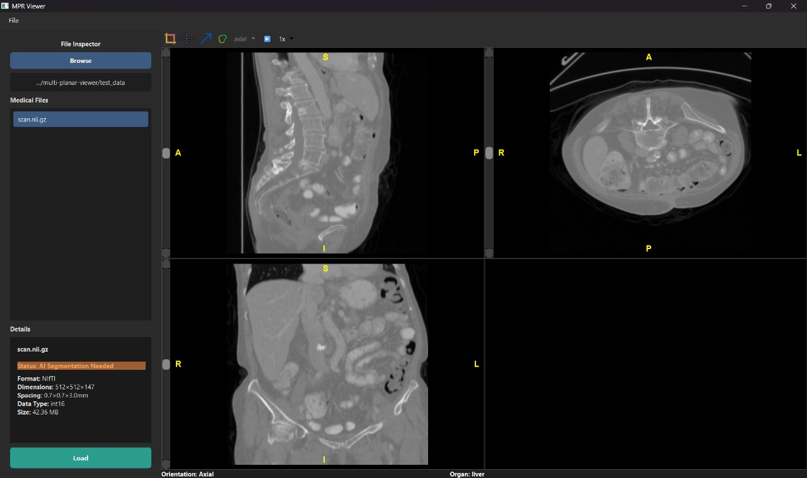
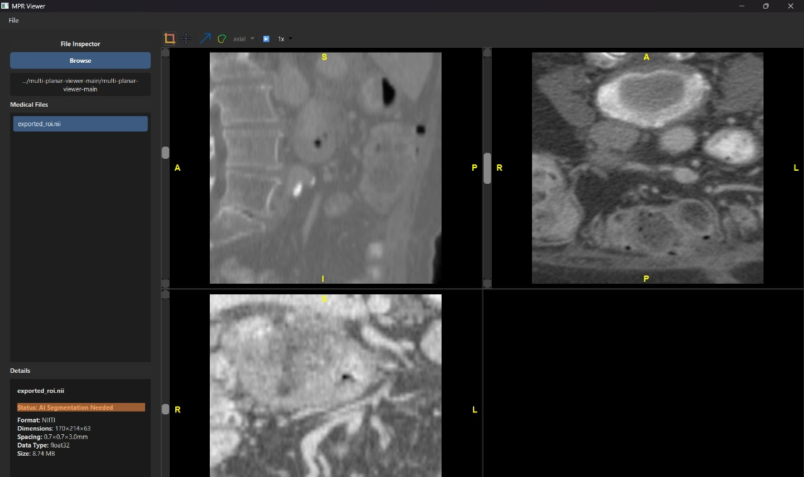
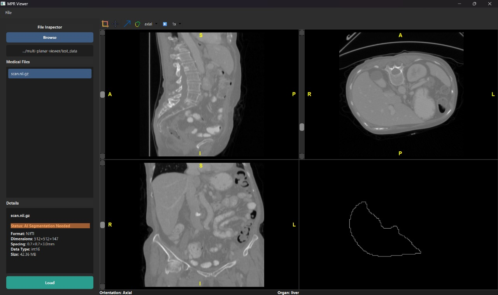
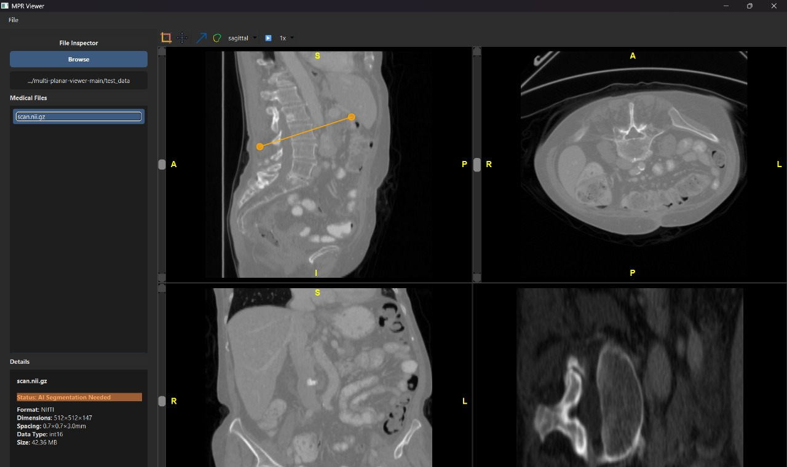

# Multi-Planar Reconstruction (MPR) Medical Image Viewer

## 📖 Overview

This repository contains a **Multi-Planar Reconstruction (MPR) Viewer** designed for the visualization and exploration of medical imaging data.
The tool enables users to view, manipulate, and analyze medical image volumes across multiple planes (axial, sagittal, coronal, and oblique), with support for both **DICOM** and **NIfTI** file formats.

Developed with performance, usability, and robustness in mind, this viewer efficiently handles large datasets and provides a comprehensive set of visualization and interaction tools commonly used in medical imaging workflows.

---

## 🧠 Key Features

* **🖼️ Multi-Planar Viewing (MPR):**
  Visualize images simultaneously across **axial**, **sagittal**, **coronal**, and **oblique** planes.

* **🧩 Orientation Detection Model:**
  A custom deep learning model that automatically determines the anatomical orientation (axial, coronal, sagittal, etc.) of the loaded image data by analyzing slice patterns and spatial consistency.
  This ensures accurate alignment and reliable multi-planar visualization — even when metadata is missing or inconsistent.

* **🫀 Organ Segmentation & Identification (TotalSegmentator):**
  Leveraging the **TotalSegmentator** framework, the viewer performs detailed 3D segmentation of anatomical structures.
  The results are used to identify and highlight the **primary organ or region of focus** within the dataset, enabling faster contextual understanding and improved visualization control.

* **📂 Broad File Format Support:**

  * DICOM (Single files & series)
  * NIfTI (.nii / .nii.gz)

* **🎞️ Interactive Navigation & Tools:**

  * Scroll through slices
  * Zoom & pan
  * Cine playback for volumetric or time-series data
  * Region of Interest (ROI) selection and inspection

* **🔄 Advanced Visualization Modes:**

  * Oblique reconstruction for custom viewing planes
  * Surface volume rendering *(shared in a dedicated 4th view with switchable mode)*

* **🧾 File Inspector:**
  Examine metadata and image properties through an integrated file inspector panel.

* **🧱 Robust Architecture:**
  Built to handle diverse datasets and unexpected input gracefully — from single-slice studies to large 4D volumes.

---

## 🧩 System Requirements

| Component    | Minimum Version         | Notes                                    |
| ------------ | ----------------------- | ---------------------------------------- |
| Python       | 3.8+                    | Recommended: 3.10+                       |
| OS           | Windows / macOS / Linux | Cross-platform                           |
| Dependencies | See `requirements.txt`  | Includes DICOM & NIfTI support libraries |

---

## ⚙️ Installation

1. **Clone the repository**

   ```bash
   git clone https://github.com/<your-username>/mpr-medical-viewer.git
   cd mpr-medical-viewer
   ```

2. **Install dependencies**

   ```bash
   pip install -r requirements.txt
   ```
3. **Install orientation model weights**
   - follow this [[link](https://drive.google.com/file/d/1UbJfOK897rJ13WNOvuHcBbh6bC4P3B1a/view?usp=sharing)]
   - paste the file inside ai/model_checkpoints.
    
5. **Run the viewer**

   ```bash
   python main.py
   ```

---

## 🧭 Usage

1. **Launch the application.**
   You will be presented with the main multi-view interface.

2. **Load data:**

   * Use the **File → Open** menu or drag-and-drop to load a DICOM series, single DICOM file, or NIfTI file.
   * The viewer automatically detects and organizes multi-slice datasets.

3. **Explore:**

   * Scroll through slices using your mouse or keyboard.
   * Adjust zoom and window/level for optimal contrast.
   * Toggle between **MPR**, **Oblique**, and **Surface Volume** modes using the view switch control.

4. **Analyze:**

   * Draw and manage **Regions of Interest (ROIs)**.
   * Inspect metadata and pixel statistics via the **File Inspector** panel.

---

## 🧪 Screenshots

| View                                                      | ROI                                                  | Volume Rendering                                |
| --------------------------------------------------------- | ---------------------------------------------------- | ----------------------------------------------- |
|  |               |  |  |

---

## 🧬 Project Background

This viewer was developed as part of a **Biomedical Engineering** coursework project at Cairo University, under the supervision of **Professor Tamer Basha**.
The project’s objective was to design a comprehensive tool capable of **loading, visualizing, and interacting with complex medical imaging datasets** in multiple planes, reflecting real-world diagnostic imaging workflows.

---

## 🧑‍💻 Contributors

* Ahmed Mamdouh Anan
* Ziad Ashraf Mostafa
* Yahya Ismail
* Hakeem Mohammed

> Supervised by **Prof. Tamer Basha**

---

## 🛡️ License

This project is licensed under the [MIT License](LICENSE).
You are free to use, modify, and distribute this software, provided that proper credit is given to the authors and supervising professor.

---

## 📫 Contact

For questions, issues, or collaboration inquiries, please reach out via:
📧 [[ahmedmamdouhenan18@gmail.com](mailto:your.email@example.com)]

---

### ⭐ If you find this project useful, please consider giving it a **star** on GitHub!
