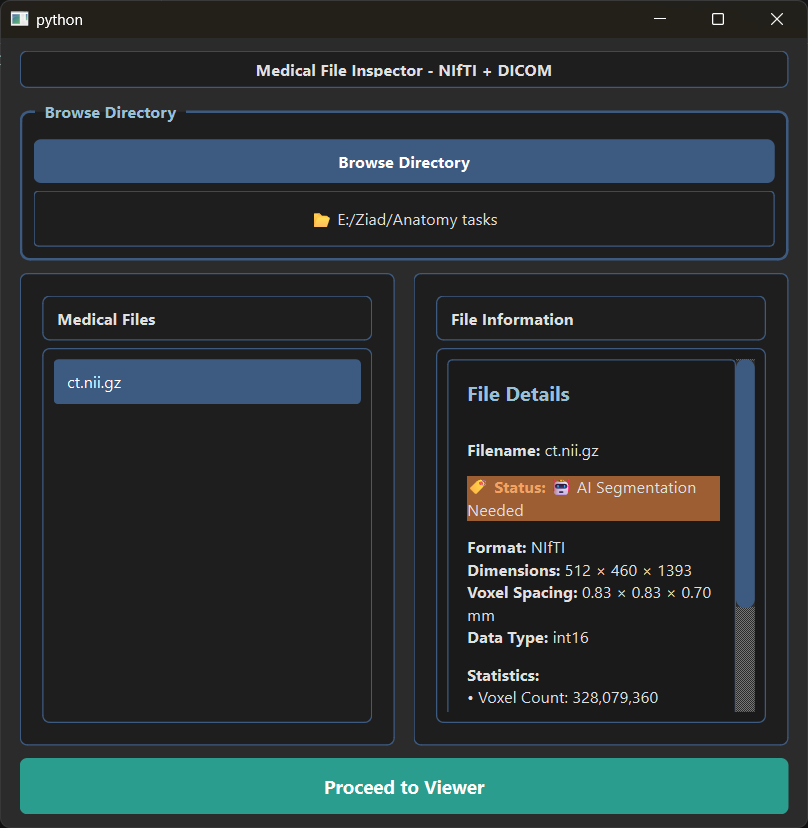
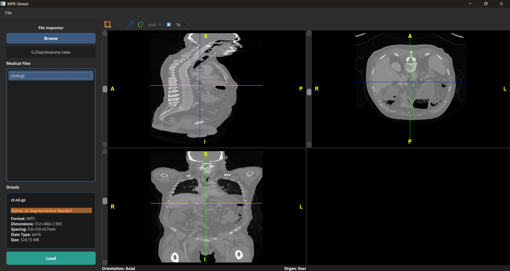
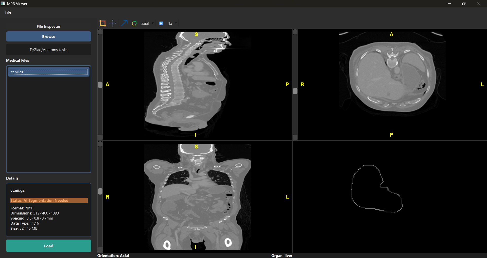
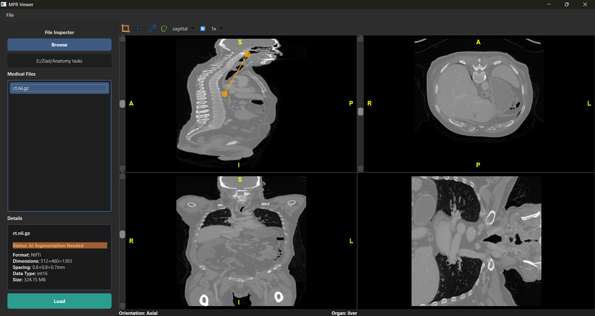
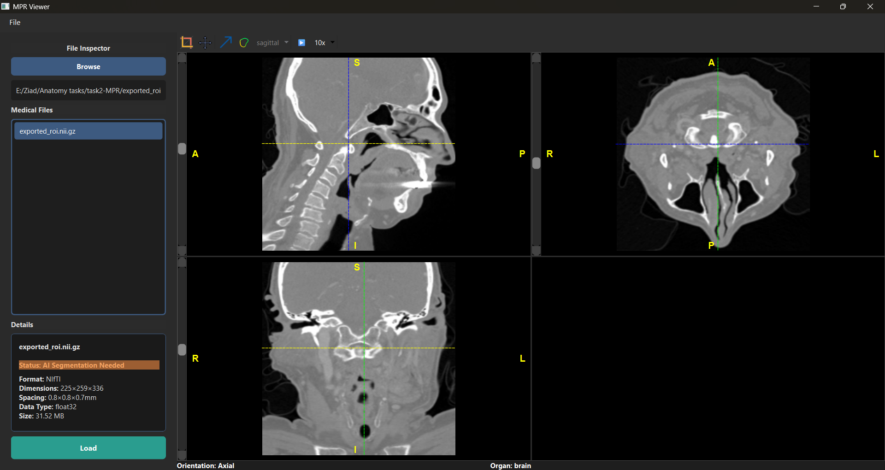
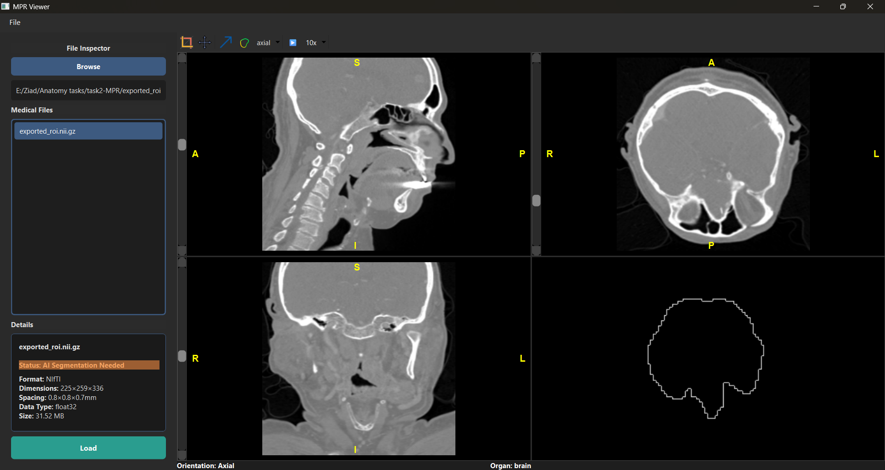

# Multi-Planar Reconstruction (MPR) Medical Image Viewer

## Overview

The **Multi-Planar Reconstruction (MPR) Viewer** is an advanced tool for visualizing and exploring medical imaging data in multiple planes (axial, sagittal, coronal, and oblique).  
It supports both **DICOM** and **NIfTI** formats and is designed for high performance, usability, and accuracy.

This viewer enables radiologists, biomedical engineers, and researchers to analyze complex datasets efficiently, providing tools for orientation detection, segmentation, oblique view and organs outline view.

This app is a students project at Cairo University faculty of engineering - Biomedical Engineering Department.
It is made for learning purpose, do NOT use in clinical aspects.

---

## Key Features

### Multi-Planar Viewing
Visualize medical images simultaneously across multiple planes:
- Axial
- Sagittal
- Coronal
- Oblique (custom-defined)
  
Includes synchronized crosshairs and linked navigation across views.

Moreover, scan organ segmentation, main organ and main scan orientation detection. 

Main organ in the scan outlines can be shown while navigation from different views.

### Automatic Orientation Detection
A deep learning model automatically determines the dataset’s anatomical orientation (axial, coronal, sagittal) by analyzing slice patterns and spatial consistency.  
This ensures reliable visualization even when metadata is incomplete or incorrect.

### Organ Segmentation (using TotalSegmentator)
Integrates the **TotalSegmentator** framework for 3D organ segmentation.  
Highlights the primary organ or anatomical region of interest, allowing faster context-based interpretation.

### Broad File Format Support
| Format | Description |
| ------- | ------------ |
| DICOM | Single files and series |
| NIfTI (.nii / .nii.gz) | 3D |

### Interactive Navigation and Tools
- Scroll through slices  
- ROI (Region of Interest) drawing
- Cine playback through slices with customizable play speed 

### Advanced Visualization Modes
- Oblique reconstruction for arbitrary plane slicing  
- Main organ outline from the chosen view while navigation through the view

### File Inspector
Integrated panel displaying:
- Easy navigation through files
- Metadata (dimensions, voxel spacing, orientation)
- Patient and acquisition information
- Image intensity histogram and statistics  

### Robust Architecture
- Efficient handling of large volumetric datasets  
- Cross-platform (Windows, macOS, Linux)  
- Modular code structure for easy extension and debugging  

---

## System Requirements

| Component | Minimum Version | Notes |
| ---------- | ---------------- | ----- |
| Python | 3.8+ | Recommended: 3.10+ |
| OS | Windows / macOS / Linux | Cross-platform |
| Dependencies | See `requirements.txt` | Includes DICOM and NIfTI libraries |

---

## Installation
  
# 1. Clone the repository
```bash
git clone https://github.com/AhmadEnan/multi-planar-viewer.git
cd mpr-medical-viewer
```

# 2. Install dependencies
```bash
pip install -r requirements.txt
```
# 3. Download and add model weights
***(Place inside ai/model_checkpoints/)***

Download Orientation Model Weights from [here](https://drive.google.com/file/d/1UbJfOK897rJ13WNOvuHcBbh6bC4P3B1a/view?usp=sharing)

# 4. Run the viewer
```bash
  python main.py
  ```

# 5. Usage
Launch the application – the main folder inspector will appear.

Browse the folder of your scan, then load (DICOM or NIfTI).

Navigate through slices using the mouse wheel or sliders.

Navigate through views MPR, Oblique, and organ outlines.

Inspect metadata through the File Inspector panel.

Cine playback to navigate slices automatically

ROI crop and export option to export a required part of scan in a new file

# 6. Screenshots and Demo
<p align="center">
  
</p>

---
***file inspector***
<p align="center">
  
</p>

---
***Main interferance***
<p align="center">
  
  
  
</p>

---
***ROI crop***
<p align="center">
  
  
  
</p>

---

# Project Background
This project was developed as part of the Biomedical Engineering coursework at Cairo University, under the supervision of Professor Tamer Basha.

## Objective:
To design a robust application capable of loading, visualizing, and interacting with medical imaging datasets in multiple planes, simulating real-world diagnostic workflows.

# Contributors and Contact
Hakeem Mohammed	Taha  -  hakeem.taha06@eng-st.cu.edu.eg

Ahmed Mamdouh Anan   -   ahmedmamdouhenan18@gmail.com

Ziad Ashraf Mostafa   -  ziad.abd-elawad06@eng-st.cu.edu.eg

Yahya Ismail      -      yahya.ismail06@eng-st.cu.edu.eg


***Supervised by*** Prof. Tamer Basha - tamer.basha@eng1.cu.edu.eg

Feel free to suggest any code enhancements or features addition or suggest contribution to make it real-world for clinical use app

# License
This project is licensed under the MIT License.
You are free to use, modify, and distribute this software with appropriate credit to the authors and supervising professor.
See the LICENSE file for details.
